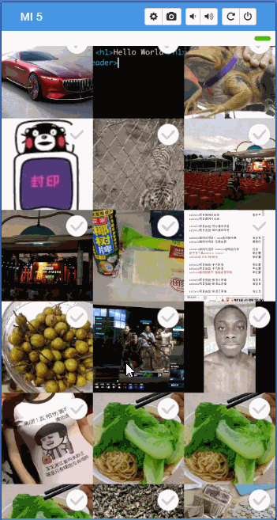

## Universal Image Loader加载本地图片

### 1.截图

### 2.使用技术

* 1.读取相册图片
* 2.Universal Image Loader加载图片
* 3.读取相册图片
* 4.解决checkbox乱序

### 3.依赖库

* [Universal Image Loader](https://github.com/nostra13/Android-Universal-Image-Loader)